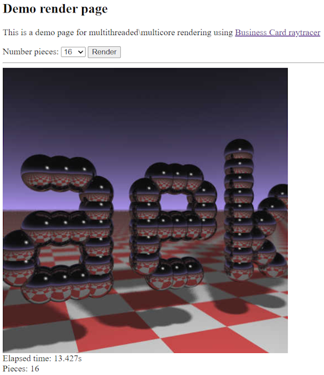

# Додаток 3
## Порядок проведення практичного заняття.

Для проведення практичного заняття в ідеальному випадку потрібен доступ до трьох робочих станцій з многоядерними процесорами (4-8 ядр). Можна обійтись і двома чи навіть одною станцією (чи 3 віртуальні машини на однієї станції) але ми не отримаємо прискорення обчислень у разі розповсюдження обчислень. У подальшому вважається що на усіх станціях встановлена операційна система **Ubuntu** версії 22 (можна використовувати Windows з встановлений віртуальній машиною VmWare Workstation, VirtualBox чи Hyper-V, також можна використовувати **WSL** версії **2** [Install WSL](https://learn.microsoft.com/en-us/windows/wsl/install)). Також вважається що на першої станції встановлена система контеризації Docker для швидкого запуску NATS  чи REDIS які використовуються у якості транспорту обміну повідомлень між обчислювальними вузлами. На усіх станціях встановлена платформа Node.js версії 20 чи більш нової. Для отримання коду з репозиторію на станціях встановлена програма **git**.

Код програми розташовано за посиланням: https://github.com/vsushche/ray.

### Підготовчі процедури 
На кожну станцію треба отримати копію репозиторію командою:
```
git clone git@github.com:vsushche/ray.git
```
Після отримання коду треба зайти до каталогу **ray** та поставити залежності
```
cd ray
npm i
```
### Демонстрація распаралеливаня обчислень по декількома ядрам одного процесору
Запускаемо наш веб сервер на одній машині командою 
```
npm run exporess
```
Після запуску заходимо до вебсторінки яка розташована за адресою `http://<station1>:8080` (де `<station1>` доменне ім'я чи IP адреса першої станції)
Ми побачимо просту веб сторінку де можна вибрати кількість частин з яких складається готове зображення. Таким чином до вебсервера буде сформована відповідна кількість запитів і він має можливість використати многопотокові і розповсюджені обчислювання для пришвидшення отримання результату. Вебсторінка заміряє час який потрібен для генерації повного зображення. Зараз у нас відбувається запуск в один потік і ми можемо побачити що розбиття на багато шматків навіть збільшує час генерації зображення. У моєму випадку з 31 секунди для однієї частини до 37 секунд у разі 256 частин. Це пояснюється допоміжним часом на обробку 256 запросів замість одного.


У консолі можна побачити лог роботи: 
```
024-12-29T11:49:08.969Z processId: 69610, starting rendering with { startX: 384, startY: 480, endX: 416, endY: 512 }
{ startX: 416, startY: 480, endX: 448, endY: 512 }
2024-12-29T11:49:09.020Z processId: 69610, starting rendering with { startX: 416, startY: 480, endX: 448, endY: 512 }
2024-12-29T11:49:09.089Z processId: 69610, finished rendering, duration 222 ms
GET /render?startX=320&startY=480&endX=352&endY=512 200 639 - 248.415 ms
```
В якому `processId: 69610` показує що використовується один процес і один потік (середа _Node.js_ за замовченням є однопоточною).

Використаємо усі наявні ядра процесора. Завершимо виконання комбінацією `Ctrl+C` та виконаємо команду 
```
npm run cluster
```
В цьому випадку викорестовується многоядерний режим платформи Node.js де проходить запуск декількох екземплярів нашої програми + один екземпляр Node.js який є керуючим і мультиплексує запити до окремих процесів з програмою
```
root@AB1768:~/ray# npm run cluster

> ray@1.0.0 cluster
> node cluster

Clustering to 8 CPUs
Listening on port 8080
Listening on port 8080
Listening on port 8080
Listening on port 8080
Listening on port 8080
Listening on port 8080
Listening on port 8080
Listening on port 8080
```
У цьому випадку маємо сутттеве прискорення:



Використаємо фрамеворк `Мoleculer` для демонстрації того що ми зможемо змінювати режим запуску без зміни коду:
`npm run mol` або `moleculer-runner --hot --instances 8 m.*.service.js`
```
root@AB1768:~/ray# npm run mol

> ray@1.0.0 mol
> moleculer-runner --hot --instances 8 m.*.service.js

Starting 8 workers...
[2024-12-29T12:24:29.270Z] INFO  ab1768-97905-5/BROKER: Moleculer v0.13.11 is starting...
[2024-12-29T12:24:29.271Z] INFO  ab1768-97905-5/BROKER: Node ID: ab1768-97905-5
[2024-12-29T12:24:29.272Z] INFO  ab1768-97905-5/BROKER: Namespace: <not defined>
[2024-12-29T12:24:29.271Z] INFO  ab1768-97898-3/BROKER: Moleculer v0.13.11 is starting...
[2024-12-29T12:24:29.272Z] INFO  ab1768-97905-5/REGISTRY: Strategy: RoundRobinStrategy
[2024-12-29T12:24:29.272Z] INFO  ab1768-97898-3/BROKER: Node ID: ab1768-97898-3
[2024-12-29T12:24:29.272Z] INFO  ab1768-97898-3/BROKER: Namespace: <not defined>
[2024-12-29T12:24:29.273Z] INFO  ab1768-97898-3/REGISTRY: Strategy: RoundRobinStrategy
[2024-12-29T12:24:29.273Z] INFO  ab1768-97905-5/BROKER: Serializer: JSONSerializer
[2024-12-29T12:24:29.274Z] INFO  ab1768-97905-5/BROKER: Registered 10 internal middleware(s).
[2024-12-29T12:24:29.274Z] INFO  ab1768-97898-3/BROKER: Serializer: JSONSerializer
[2024-12-29T12:24:29.275Z] INFO  ab1768-97898-3/BROKER: Registered 10 internal middleware(s).
[2024-12-29T12:24:29.275Z] INFO  ab1768-97912-7/BROKER: Moleculer v0.13.11 is starting...
[2024-12-29T12:24:29.278Z] INFO  ab1768-97912-7/BROKER: Node ID: ab1768-97912-7
[2024-12-29T12:24:29.278Z] INFO  ab1768-97912-7/BROKER: Namespace: <not defined>
```
У даному випадку у нас запускається 2 сервіса
* `m.api.service.js` де є реалізація нашого веб сервера. Цей вебсервер отримує запит і перенаправляє його до одного з воркерів за допомогою компонента Брокер.
* `m.render.service.js` де є реалізація воркера який виконує рендерінг.

Результат роботи у цьому випадку нагадує кластеризацію за допомогою вбудованих у Node.js засобів

### Демонстрація розповсюдження обчислень по декількома обчислювальними вузлами

Запустимо NATS сервер обміну повідомленнями. Бажано це робити на окремій машині:
`npm run nats` або `docker run -d --rm --name nats -p 4222:4222 nats`.

Запустимо api мікросервіс командой `TRANSPORTER=nats://<nats>:4222 moleculer-runner --instances 1 m.api.service.js` або `npm run mol-api-nats`. Замість `<nats>` треба підставити ім'я чи IP адресу де працює NATS сервер. У разі використання `npm run mol-api-nats` треба виправити адресу у файлі package.json. Ми запускаємо один екземпляр  сервісу який приймає запити і пересилає їх воркерам.

На інший
